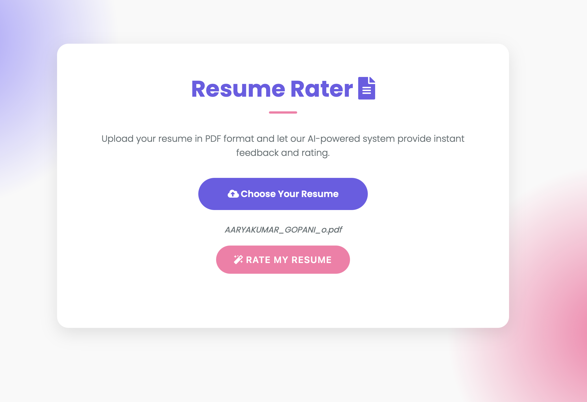
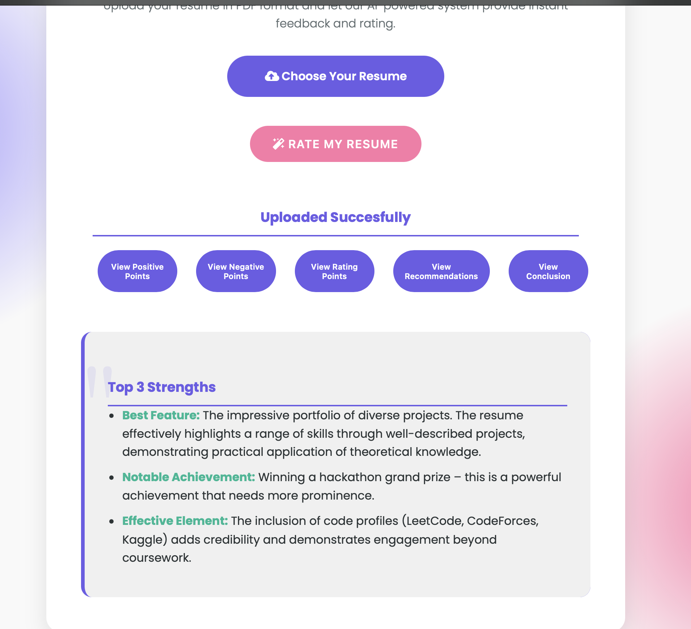

# Resume Rater

## Use of LLM API for Creating an AI Powered Resume Rating System

### `gemini-1.5-flash-latest` is used for rating the resume

Read more about Gemini: [https://deepmind.google/technologies/gemini/flash/](https://deepmind.google/technologies/gemini/flash/)

### Setup Instructions

1. Create a `.env` file in your project folder.
2. Paste your `GEMINI_API_KEY` in the `.env` file.

### How It Works

- The user uploads their resume in `.pdf` format.
- The text is extracted from the resume using the `PyPDF2` Python library.
- The extracted text is passed to the LLM API for rating.
- The rating is displayed to the user.

### Python Frameworks and Libraries

All required Python packages are listed in `requirements.txt`.

---

## Project Screenshots

